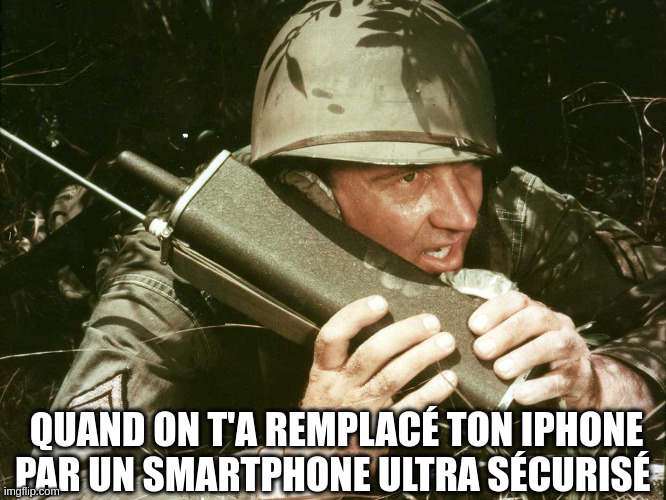

# FCSC 2024 broadcastopol

Le théâtre géopolitique s’est dégradé pour nous dernièrement. Un de nos alliés semble avoir modifié des équipements de communication que nous lui avons fourni initialement. En effet, depuis quelques jours nos échanges sont interrompus. En revanche, un de nos agents sur le terrain a intercepté une de leurs diffusions (```flag.wav.enc```). D’après nos renseignements, elle est d’importance tactique.

Un de nos cryptographes nous a indiqué que l’algorithme de chiffrement est utilisé dans un mode de stream cipher classique et que nous savons que les données en clair sont des fichiers WAV. Son équipe a également réussi à obtenir un clair connu (```known.wav```/```known.wav.enc```) pour lequel nous avons connaissance de ces éléments :

- ```IV = 0x000dcf18 ```;
- ```eck = 0x1119EB502F815EB502F8``` (```eck```, Encryption Cipher Key).


Par ailleurs, pour le message chiffré ```flag.wav.enc``` intercepté, les analyses opérationnelles indiquent que la valeur de l’IV devrait être ```0x0026b328```.

**Note :** le flag est au format ```FCSC{contenu_diffusion}```. Le contenu est en anglais. Sa retranscription dans le flag est en minuscules et entre chaque mot il y a un ```_```. Exemple : si j’entends *“You made good today”*, le flag est : ```FCSC{you_made_good_today}```.




Auteurs : exti0p

Origine : [broadcastopol](https://hackropole.fr/fr/challenges/crypto/fcsc2024-crypto-broadcastopol/)


Fichiers :
- [flag.wav.enc](flag.wav.enc)
- [known.wav](known.wav)
- [known.wav.enc](known.wav.enc)


-----------


## Installation manuel
Vous n'utilisez pas l'application **les CTFs de Cyrhades** ? C'est dommage !
Mais voici comment installer ce CTF manuellement :

> git clone https://github.com/Hack-Oeil/fcsc2024-crypto-broadcastopol.git

> cd fcsc2024-crypto-broadcastopol


-----------

## Sur le site officiel hackropole.fr
> https://hackropole.fr/fr/challenges/crypto/fcsc2024-crypto-broadcastopol/